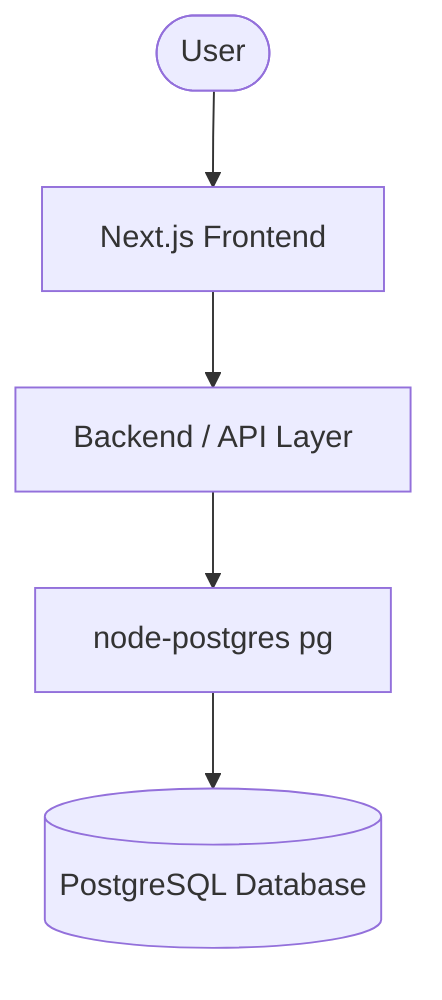

# CampusConnect – College Club & Event Management System

> **STATUS:** ⚠️ DESIGN / DOCUMENTATION PHASE
> *Implementation has not begun yet. All features, architecture, and schemas described below are proposed designs for the upcoming development phase.*

## 1. Project Title
CampusConnect – College Club & Event Management System

## 2. Project Description
CampusConnect is a centralized, database-driven platform designed to streamline the administration and participation of extracurricular activities on campus. It provides a cohesive system for students to discover clubs, register for events, and track their participation, while enabling club coordinators to manage memberships, organize events, and track attendance.

## 3. Problem Statement
Managing college clubs and events currently relies on scattered forms, disparate spreadsheets, and fragmented messaging channels. This decentralized approach causes inefficiencies, manual tracking errors, and data loss. CampusConnect solves this by centralizing all club and event data into a single, robust relational database (PostgreSQL), ensuring data integrity and accessibility.

## 4. Objectives
* Centralize college club information and membership data.
* Streamline event creation, registration, and attendance tracking.
* Demonstrate core SQL and DBMS concepts (normalization, referential integrity, constraints).
* Generate meaningful statistics and reports from database data.

## 5. User Roles
* **Student:** Browse clubs/events, register, submit feedback, view history.
* **Club Coordinator:** Manage assigned clubs, create events, mark attendance, manage volunteers.
* **Admin:** System-wide management of students, clubs, venues, events, and reports.

## 6. Features / Modules
* Student Management
* Club Management & Memberships
* Event Management & Registrations
* Venue Management
* Attendance Tracking
* Feedback System
* Volunteer Management
* Certificate Management
* Reports & Statistics

## 7. Database Overview (Proposed)
The system will rely on a PostgreSQL database with the following core entities:
`Student`, `Club`, `Club Membership`, `Club Coordinator`, `Venue`, `Event`, `Event Registration`, `Attendance`, `Feedback`, `Volunteer`, `Event Volunteer`, `Certificate`.

## 8. Main Relationships
* **Student ↔ Club:** Many-to-many (via Club Membership)
* **Club → Event:** One-to-many
* **Venue → Event:** One-to-many
* **Student ↔ Event:** Many-to-many (via Event Registration)

## 9. DBMS Concepts Demonstrated
* Normalization (up to 3NF)
* Primary and Foreign Keys
* Constraints (UNIQUE, NOT NULL, CHECK, DEFAULT)
* Complex Queries (JOINs, GROUP BY, Subqueries)
* Views, Indexes, and Transactions

## 10. Tech Stack
* **Frontend:** Next.js, TypeScript, Tailwind CSS
* **Backend:** Next.js Route Handlers, Node.js
* **Database:** PostgreSQL (with `pg` driver)
* **Tools:** pgAdmin, Git, GitHub, VS Code

## 11. Architecture

## 12. Application Flow
* **Student:** Register/Login → Dashboard → Browse/Join Clubs → Register for Events → Mark Attendance → Provide Feedback → View Certificates.
* **Coordinator:** Login → Assigned Club → Create Event → Manage Registrations/Volunteers → Mark Attendance → View Statistics.
* **Admin:** Login → Dashboard → Manage System Data (Users/Venues/Clubs) → View Reports.

## 13. Team
**QueryMinds** (3 Members)
* **Member 1 (Database & SQL):** ER design, schema, normalization, PostgreSQL setup, queries.
* **Member 2 (Frontend & UI):** UI design, Next.js pages, responsive forms.
* **Member 3 (Backend & Integration):** API design, DB connectivity, logic, integration.

## 14. Documentation Reference
Detailed academic documentation can be found in the [`docs/`](./docs) folder:
* [Project Documentation PDF](./docs/CampusConnect_Project_Documentation.pdf)
* [Requirements](./docs/requirements.md)
* [Database Design](./docs/database-design.md)
* [ER Diagram](./docs/er-diagram.md)
* [Relational Schema](./docs/relational-schema.md)
* [Normalization](./docs/normalization.md)

## 15. Future Scope
* QR-based attendance tracking.
* Mobile application development.
* Institutional calendar integration.
* Advanced analytics and event recommendations.

## 16. Current Project Status
Currently in the **Documentation and Design Phase**. No implementation code has been written yet.
