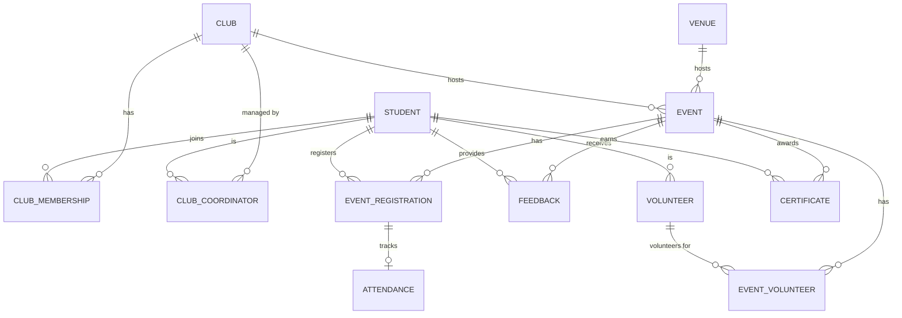

    <h1>CampusConnect</h1>
    <h2>College Club & Event Management System</h2>
    <h3>Database Management Systems Project</h3>
       
    <h4>Team: QueryMinds</h4>
    <h4>3-Member Team</h4>
    <h4>Technology Focus: PostgreSQL + SQL</h4>

# 2. Project Overview
CampusConnect is a centralized college platform for managing clubs, club memberships, events, venues, event registrations, attendance, feedback, volunteers, certificates, participation history, and reports/statistics.
PostgreSQL and DBMS concepts are central to the project, forming the robust data backbone of the application.

# 3. Problem Statement
Managing club and event information through scattered forms, spreadsheets, messages, and separate records causes inefficiencies and data loss. CampusConnect provides a centralized relational system to resolve this, ensuring that data is securely stored, related, and easily retrievable.

# 4. Objectives
* Centralize college club information.
* Manage memberships, events, registrations, attendance, feedback, volunteers, and certificates.
* Maintain data integrity.
* Demonstrate SQL and DBMS concepts.
* Generate meaningful statistics from database data.

# 5. Users and Roles
### Student
* Register/login, View profile, Browse clubs, View club details, Join clubs.
* Browse events, View event details, Register for events, View registered events.
* View attendance, Submit feedback, View certificates, View participation history.

### Club Coordinator
* View assigned club, Create events, Edit events, Cancel events.
* View registrations, Manage volunteers, Mark attendance, View feedback, View event statistics.

### Admin
* Manage students, clubs, coordinators, venues, events.
* View registrations, attendance, feedback, certificates, reports, system-wide statistics.

# 6. System Flow

### Student Flow
Register/Login → Student Dashboard → Browse Clubs → View Club → Join Club → Browse Events → View Event → Register for Event → My Events → Attendance → Feedback → Certificate → Participation History

### Coordinator Flow
Login → Coordinator Dashboard → Assigned Club → Create/Edit Event → Select Venue → Set Capacity → Set Registration Deadline → Publish Event → View Registrations → Manage Volunteers → Mark Attendance → View Feedback → Event Statistics

### Admin Flow
Login → Admin Dashboard → Students → Clubs → Coordinators → Venues → Events → Registrations → Attendance → Feedback → Certificates → Reports & Statistics

# 7. Modules
1. **Student Management**: Purpose is to manage student profiles. User is Admin/Student.
2. **Club Management**: Manage club details.
3. **Club Membership**: Track student club affiliations.
4. **Coordinator Management**: Map students to club coordinator roles.
5. **Venue Management**: Manage physical locations for events.
6. **Event Management**: Create and schedule events.
7. **Event Registration**: Track students attending events.
8. **Attendance**: Mark presence for registered students.
9. **Feedback**: Collect ratings and comments post-event.
10. **Volunteer Management**: Assign students as volunteers for events.
11. **Certificate Management**: Issue and track certificates for events.
12. **Reports & Statistics**: Generate admin-level insights.

# 8. Database Design
### Student
student_id (PK), name, email, phone, department, semester, password, created_at, status

### Club
club_id (PK), club_name, description, category, established_date, status

### Club Membership
membership_id (PK), student_id (FK), club_id (FK), join_date, membership_status

### Club Coordinator
coordinator_id (PK), club_id (FK), student_id (FK), start_date, end_date, status

### Venue
venue_id (PK), venue_name, location, capacity, status

### Event
event_id (PK), club_id (FK), venue_id (FK), event_name, description, event_date, start_time, end_time, capacity, registration_deadline, status

### Event Registration
registration_id (PK), event_id (FK), student_id (FK), registration_date, registration_status

### Attendance
attendance_id (PK), registration_id (FK), attendance_status, marked_at

### Feedback
feedback_id (PK), event_id (FK), student_id (FK), rating, comment, submitted_at

### Volunteer
volunteer_id (PK), student_id (FK)

### Event Volunteer
event_volunteer_id (PK), event_id (FK), volunteer_id (FK), assigned_at, role

### Certificate
certificate_id (PK), student_id (FK), event_id (FK), certificate_type, issue_date, certificate_number

# 9. Relationships
* **Student ↔ Club**: Many-to-many through Club Membership.
* **Club → Event**: One-to-many.
* **Venue → Event**: One-to-many.
* **Student ↔ Event**: Many-to-many through Event Registration.
* **Event Registration → Attendance**: One-to-zero-or-one.
* **Student ↔ Event (Feedback)**: Many-to-many through Feedback.
* **Event ↔ Volunteer**: Many-to-many through Event Volunteer.
* **Student → Certificate**: One-to-many.
* **Event → Certificate**: One-to-many.

# 10. ER Diagram

# 11. Relational Schema
* `student` (**student_id**, name, email (UNIQUE), phone, department, semester, password, created_at, status)
* `club` (**club_id**, club_name (UNIQUE), description, category, established_date, status)
* `club_membership` (**membership_id**, *student_id*, *club_id*, join_date, membership_status)
* `club_coordinator` (**coordinator_id**, *club_id*, *student_id*, start_date, end_date, status)
* `venue` (**venue_id**, venue_name (UNIQUE), location, capacity, status)
* `event` (**event_id**, *club_id*, *venue_id*, event_name, description, event_date, start_time, end_time, capacity, registration_deadline, status)
* `event_registration` (**registration_id**, *event_id*, *student_id*, registration_date, registration_status)
* `attendance` (**attendance_id**, *registration_id*, attendance_status, marked_at)
* `feedback` (**feedback_id**, *event_id*, *student_id*, rating, comment, submitted_at)
* `volunteer` (**volunteer_id**, *student_id*)
* `event_volunteer` (**event_volunteer_id**, *event_id*, *volunteer_id*, assigned_at, role)
* `certificate` (**certificate_id**, *student_id*, *event_id*, certificate_type, issue_date, certificate_number (UNIQUE))

# 12. Normalization
* **UNF to 1NF:** Removed multi-valued attributes (e.g., arrays of clubs in student table). All attributes are atomic.
* **1NF to 2NF:** Removed partial dependencies. Every non-key attribute is fully functionally dependent on the primary key.
* **2NF to 3NF:** Removed transitive dependencies. `venue_name` is in `venue`, not duplicated in `event`.

# 13. Database Constraints
* **PRIMARY KEY:** Ensures unique identification of records.
* **FOREIGN KEY:** Ensures referential integrity (e.g., student joining a club must exist in student table).
* **UNIQUE:** Student email must be unique.
* **NOT NULL:** Mandatory fields like names and dates.
* **CHECK:** Event capacity > 0, feedback rating between 1 and 5.
* **DEFAULT:** Setting `created_at` to current timestamp.

# 14. Business Rules (Proposed)
1. Every student has a unique identity.
2. A student cannot have duplicate membership in the same club.
3. A student cannot register for the same event twice.
4. An event belongs to a club.
5. An event uses a venue.
6. Event registration must respect capacity.
7. Registration must respect the registration deadline.
8. Feedback should be associated with a valid event/student relationship.
9. Attendance should correspond to an event registration.
10. Coordinators should only manage their assigned clubs.

# 15. SQL Concepts
The project will demonstrate CRUD operations (SELECT, INSERT, UPDATE, DELETE), filtering (WHERE), sorting (ORDER BY), aggregation (GROUP BY, HAVING, Aggregate functions), relationships (JOINs), logic (CASE, Subqueries), and optimizations (Views, Indexes, Transactions).

# 16. Important Query Requirements
* **Upcoming events:** What are the next events? Joins Event and Venue. Demonstrates WHERE date condition.
* **Most active clubs:** Which clubs host the most events? Joins Club and Event. Demonstrates GROUP BY and COUNT().
* **Average event rating:** How was the event rated? Joins Event and Feedback. Demonstrates AVG().

# 17. Views & Indexes
* **Proposed Views:** Upcoming Events View, Event Registration Summary, Club Participation Summary, Student Participation History, Event Feedback Summary.
* **Proposed Indexes:** Event date, Event registration (student ID, event ID), Club membership (student ID, club ID).

# 18. Tech Stack & Architecture
* **Frontend:** Next.js, TypeScript, Tailwind CSS
* **Backend:** Next.js Route Handlers, Node.js
* **Database:** PostgreSQL (with `pg`)
* **System Architecture:** User → Next.js Frontend → Backend / API Layer → node-postgres → PostgreSQL Database.

# 19. Team Division
* **Member 1 (Database & SQL):** ER diagram, Relational schema, Normalization, PostgreSQL design, Constraints, SQL queries, Views, Indexes, Database testing.
* **Member 2 (Frontend & UI):** UI design, Next.js pages, Dashboards, Forms, Navigation, Responsive design.
* **Member 3 (Backend & Integration):** API design, Database connectivity, Validation, Role-based operations, Frontend/backend integration, Testing.

# 20. Development Phases
Phase 1: Requirements → Phase 2: ER Design → Phase 3: Relational Design → Phase 4: Normalization → Phase 5: PostgreSQL Design → Phase 6: SQL Queries → Phase 7: Backend/API → Phase 8: Frontend → Phase 9: Integration → Phase 10: Testing → Phase 11: Final Documentation → Phase 12: Deployment.

# 21. Testing Plan (Planned)
* Student registration, Login, Club joining, Event creation, Event registration, Capacity checks, Attendance, Feedback, Role restrictions, CRUD operations, Database constraints, Referential integrity.

# 22. Limitations & Future Scope
* **Limitations:** Undergraduate academic project, limited offline support.
* **Future Scope:** QR-based attendance, Notifications, Calendar integration, Advanced analytics, Mobile app.
