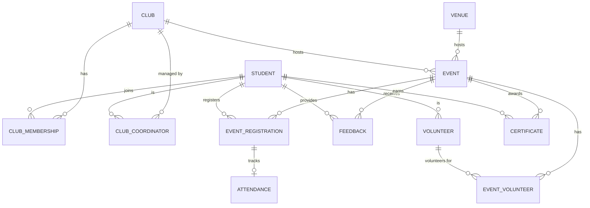

# ER Diagram

```mermaid
erDiagram
    STUDENT ||--o{ CLUB_MEMBERSHIP : "joins"
    CLUB ||--o{ CLUB_MEMBERSHIP : "has"
    STUDENT ||--o{ CLUB_COORDINATOR : "is"
    CLUB ||--o{ CLUB_COORDINATOR : "managed by"
    CLUB ||--o{ EVENT : "hosts"
    VENUE ||--o{ EVENT : "hosts"
    STUDENT ||--o{ EVENT_REGISTRATION : "registers"
    EVENT ||--o{ EVENT_REGISTRATION : "has"
    EVENT_REGISTRATION ||--o| ATTENDANCE : "tracks"
    STUDENT ||--o{ FEEDBACK : "provides"
    EVENT ||--o{ FEEDBACK : "receives"
    STUDENT ||--o{ VOLUNTEER : "is"
    VOLUNTEER ||--o{ EVENT_VOLUNTEER : "volunteers for"
    EVENT ||--o{ EVENT_VOLUNTEER : "has"
    STUDENT ||--o{ CERTIFICATE : "earns"
    EVENT ||--o{ CERTIFICATE : "awards"
```
